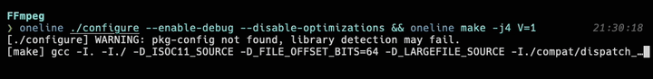

# oneline

Run commands with all output displayed on a single line for cleaner terminal output.

## Features



- Shows command output on a single, continuously updating line
- Automatically truncates output to fit your terminal width
- Preserves ANSI color codes and formatting
- Optional custom labels for the output line
- Shows full output on error for easy debugging

## Installation

### Nix

```sh
nix profile install github:0rvar/oneline
```

Or add to your flake to make available in direnv, something like:

```nix
{
  inputs.oneline.url = "github:0rvar/oneline";
  # ...
  outputs = { self, nixpkgs, oneline }: {
    packages = forAllSystems (pkgs: system: {
      buildInputs = [oneline]
    })
  };
}
```

### Cargo

```sh
cargo install oneline
```

## Usage

```
oneline [--label "Custom Label"] command [args...]
```

### Examples

Run a build command with default label:

```
oneline cargo build --release
```

Run with a custom label:

```
oneline --label "Installing Deps" npm install
```

Run multiple commands with descriptive labels:

```
oneline --label "Building Frontend" npm run build && \
oneline --label "Building Backend" cargo build --release
```

## Why use oneline?

Many command-line tools produce verbose, multi-line output that can clutter your terminal. `oneline` condenses all that output into a single, continuously updating line, keeping your terminal clean while still showing you what's happening.

Perfect for:

- Build scripts and CI pipelines
- Installation processes
- Any verbose commands where you want to see progress without the clutter

## License

MIT
